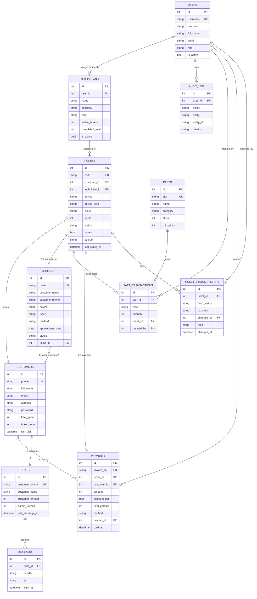

# FFC — Entity Relationship Diagram



## Diễn giải quan hệ

### Quan hệ chính
- **Customer 1 ─ ∞ Ticket**: Một khách có nhiều phiếu. Không xoá khách nếu còn phiếu (`ON DELETE RESTRICT`).
- **Technician 1 ─ ∞ Ticket**: KTV được phân công. Xoá KTV → ticket.technician_id = NULL.
- **Ticket 1 ─ 0..1 Payment**: Mỗi phiếu chỉ thu tiền 1 lần (constraint ở application logic).
- **Ticket 1 ─ ∞ Status History**: Log toàn bộ chuyển trạng thái — CASCADE delete khi xoá ticket.
- **Booking 1 ─ 0..1 Ticket**: Sau khi confirm, booking link tới ticket được sinh.

### Quan hệ tra cứu
- **Chat 1 ─ 1 Customer**: Liên kết qua `customer_phone` (không FK chính thức vì khách có thể chat trước khi tạo profile).
- **Customer 1 ─ ∞ Payment**: Lịch sử chi tiêu.
- **Part 1 ─ ∞ PartTransaction**: Lịch sử nhập/xuất.

### Audit
- **User 1 ─ ∞ AuditLog**: Mọi hành động quan trọng được log.
- **AuditLog → entity**: Polymorphic — `entity` + `entity_id` trỏ tới bất kỳ table nào.

## Quy ước

- **PK** = Primary Key (INTEGER AUTOINCREMENT)
- **FK** = Foreign Key (có constraint ON DELETE)
- **UK** = Unique Key
- Tất cả timestamp dùng `DATETIME` mặc định `CURRENT_TIMESTAMP`
- Snake_case cho tên cột

## Render ERD

File này dùng Mermaid syntax. Để xem hình:

1. **VSCode**: Cài extension "Markdown Preview Mermaid Support" → mở file → preview
2. **GitHub**: Tự render mermaid trong markdown
3. **Online**: Copy code vào https://mermaid.live
4. **Export PNG/PDF**: Dùng `mermaid-cli`:
   ```bash
   npx -p @mermaid-js/mermaid-cli mmdc -i ERD.md -o ERD.png
   ```
